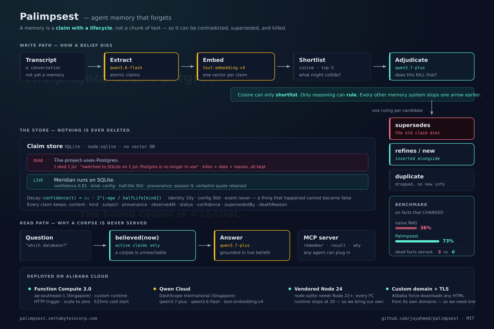

# Palimpsest

> *palimpsest (n.) - a manuscript scraped clean and written over, where traces of
> the earlier text still show through.*

**Agent memory that forgets.**

Built for the **Global AI Hackathon Series with Qwen Cloud** · Track: **MemoryAgent**

---



## The bug

Ask any AI agent with memory what port your dev server runs on. It will answer
instantly, confidently, and - if the port ever changed - **wrong**.

Not because retrieval failed. Because retrieval *worked*, exactly as designed.

Every memory system shipping today stores text, embeds it, and retrieves whatever
is most **similar** to your question. So watch what that does to two claims that
flatly contradict each other:

```
"We decided to use Postgres."    vs   "We decided NOT to use Postgres."      0.93
"The API listens on port 3000."  vs   "Port 3000 is where the API listens."  0.91
```

*(Real numbers. Run `pnpm explain` yourself.)*

**The contradiction scores higher than the paraphrase.** To a vector store,
"we decided to use Postgres" and "we decided *not* to use Postgres" are more alike
than two ways of saying the same true thing - because embeddings capture *topic*,
not *truth*. The single word that reverses the entire meaning barely moves the
number.

You cannot fix this with a threshold. Any cutoff that keeps the paraphrase keeps
the contradiction. **The signal is not in the number.**

So the retriever hands the model both the live fact and the dead one, ranked side
by side, with no way to tell them apart. The model picks whichever won the cosine
coin-flip. That is why your agent lies to you fluently.

## Why nobody fixes it

Memory systems store **chunks**. A chunk is not a unit of truth - one paragraph
holds five facts, three still true and two dead. You cannot delete half a chunk.
You cannot edit it, because you don't know which sentence went bad.

So the only move left is to append a new chunk and leave the old one there.

**That is why every memory system is append-only.** Not for lack of imagination -
they have no unit small enough to kill.

## What Palimpsest does

A memory is not a chunk here. It is a **claim**: one atomic assertion,
independently true or false - which means it can have a status, which means it can
**die**.

Each claim carries:

- **Provenance** - where it came from, and when it became true in the world.
- **Kind** - because facts don't rot at one universal rate. `identity` has a
  ten-year half-life; `config` has thirty days; an `event` never decays at all,
  because a thing that happened cannot become false.
- **Confidence** - decaying exponentially from birth at the rate its kind implies.
- **History** - when a claim dies, we keep the body, the killer, the date, and the
  reason.

And four mechanisms:

1. **Extraction** - a transcript is not a memory. Qwen distills it into atomic claims.
2. **Adjudication** - a new claim doesn't just get appended. We find what it might
   collide with and ask Qwen to *rule*: update, contradiction, refinement, or new.
   Cosine finds the candidates; only reasoning can decide which one is **dead**.
3. **Decay** - confidence erodes at a rate set by what kind of fact it is.
4. **Verification** - claims that assert something checkable get re-checked, and
   demoted when the world moves on.

Nothing is overwritten. You can always ask: *what did you used to believe, and when
did you stop?*

## The benchmark

12 sessions of a real-shaped project, spread over three months. Facts change: the
database is swapped, the launch slips, the brand colour moves, the PM is replaced.
Then we ask both memories what is true **now**.

The baseline is naive RAG - chunk, embed, top-k retrieve - given the *same*
extraction, the *same* embeddings and the *same* answering model. The only
difference between the two systems is that one of them can kill a claim.

|                          | naive RAG    | Palimpsest     |
|--------------------------|--------------|----------------|
| Facts that **changed**   | 36% (4/11)   | **73% (8/11)** |
| Facts that never changed | 88% (7/8)    | 88% (7/8)      |
| **Overall**              | 58% (11/19)  | **79% (15/19)**|
| **Served a DEAD fact**   | **3**        | **0**          |

Twice as accurate on facts that moved - and, just as importantly, **no worse on the
facts that didn't**. A memory eager enough to forget that it destroys stable facts
would be worse than append-only, not better. That column is the one that could have
killed this project, and it's printed as loudly as the one that flatters it.

Naive RAG served three dead facts - "Postgres", "September 1st", "#1E4D8C" - with
total confidence, weeks after each one died. Palimpsest served none.

**Where it still fails**, because that belongs in the README too: it answers `"ams"`
(a region) instead of `"Fly.io"` for where the app is deployed, and it never finds
the PM handover at all. Both are *retrieval* failures - the right claim was alive in
the store and simply wasn't reached. Full breakdown, including every question both
systems got wrong: [`src/bench/RESULTS.md`](src/bench/RESULTS.md).

### Check it yourself

Every model call is cached to disk and committed to this repo.

```bash
PALIMPSEST_CACHE_ONLY=1 pnpm bench     # 448 cache hits, 0 misses, no API key, no spend
```

**Clone it, replay the benchmark, and get bit-identical numbers.**
`PALIMPSEST_CACHE_ONLY=1` makes a cache miss *throw* rather than quietly hit the API,
so a replay cannot silently drift from what we published.

We'd rather you checked than trusted us. (We checked, too - and the first time we
tried this, it threw. See v3 in the results file.)

## Running it

```bash
pnpm install
cp .env.example .env      # add your Qwen Cloud key
pnpm smoke                # verify Qwen: chat, adjudicate, embed
pnpm explain              # see the bug for yourself
```

> **Note:** Qwen Cloud keys live on the **international (Singapore)** DashScope
> endpoint. Pointing them at the mainland-China endpoint returns `401
> invalid_api_key` even though the key is perfectly valid. This will cost you an
> hour if you let it.

## Stack

TypeScript · Qwen Cloud (`qwen3.7-plus`, `qwen3.6-flash`, `text-embedding-v4`) ·
SQLite (`node:sqlite`, no native deps) · deployed on Alibaba Cloud Function Compute

No vector database. At a few thousand claims, brute-force cosine is microseconds -
and the hard problem here was never retrieval speed. It was deciding which
retrieved claims are still **true**.

## License

MIT
