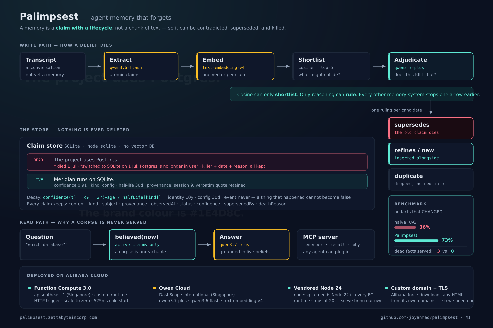

# Palimpsest

> *palimpsest (n.) - a manuscript scraped clean and written over, where traces of
> the earlier text still show through.*

**Agent memory that forgets.** A local MCP memory for Claude Code whose beliefs decay
and can die - so the port, the branch, the password your agent repeats is the *current*
one, and the old one is on record as dead, with the reason.

It runs on your machine, on the Claude Code login you already have. No API key, no
server, no vector database: one SQLite file, one Node process, and a hook that puts what
it believes into every session.

**Status:** a tool one developer uses every day, public so anyone can run it. It began as
an entry to the Global AI Hackathon Series with Qwen Cloud (judged version tagged
[`qwen-submission`](../../tree/qwen-submission)); the benchmark from that entry is below,
with the caveats it deserves. The mechanism is tested end to end by one command, live,
in about a minute - that is the first thing to run.

```bash
pnpm install && pnpm test
```

---



## The bug

Ask any AI agent with memory what port your dev server runs on. It will answer
instantly, confidently, and - if the port ever changed - **wrong**.

Not because retrieval failed. Because retrieval *worked*, exactly as designed.

Every memory system shipping today stores text, embeds it, and retrieves whatever
is most **similar** to your question. So watch what that does to two claims that
flatly contradict each other:

```
                                                                    Qwen    bge-small
"We decided to use Postgres."    vs   "We decided NOT to use Postgres."   0.93    0.78
"The API listens on port 3000."  vs   "Port 3000 is where the API listens."  0.91    0.98
```

*(Real numbers, two embedders. Run `pnpm explain` yourself - it prints whichever
one you are running.)*

With Qwen's embedder **the contradiction scores higher than the paraphrase**; with
bge-small it scores lower, at 0.78 - and 0.78 is still "closely related", well
inside what any retriever returns. Either way the point holds: to a vector store,
"we decided to use Postgres" and "we decided *not* to use Postgres" are close,
because embeddings capture *topic*, not *truth*. The single word that reverses the
entire meaning moves the number a little, or not at all, depending on the model.

You cannot fix this with a threshold. A cutoff tight enough to drop the
contradiction drops real paraphrases with it - the numbers overlap from one
embedder to the next. **The signal is not in the number.**

So the retriever hands the model both the live fact and the dead one, ranked side
by side, with no way to tell them apart. The model picks whichever won the cosine
coin-flip. That is why your agent lies to you fluently.

## Why nobody fixes it

Memory systems store **chunks**. A chunk is not a unit of truth - one paragraph
holds five facts, three still true and two dead. You cannot delete half a chunk.
You cannot edit it, because you don't know which sentence went bad.

So the only move left is to append a new chunk and leave the old one there.

**That is why every memory system is append-only.** Not for lack of imagination -
they have no unit small enough to kill.

## What Palimpsest does

A memory is not a chunk here. It is a **claim**: one atomic assertion,
independently true or false - which means it can have a status, which means it can
**die**.

Each claim carries:

- **Provenance** - where it came from, and when it became true in the world.
- **Kind** - because facts don't rot at one universal rate. `identity` has a
  ten-year half-life; `config` has thirty days; an `event` never decays at all,
  because a thing that happened cannot become false.
- **Confidence** - decaying exponentially from birth at the rate its kind implies.
- **History** - when a claim dies, we keep the body, the killer, the date, and the
  reason.

And three mechanisms:

1. **Extraction** - a transcript is not a memory. The model distills it into atomic claims.
2. **Adjudication** - a new claim doesn't just get appended. We find what it might
   collide with and ask the model to *rule*: update, contradiction, refinement, or new.
   Cosine finds the candidates; only reasoning can decide which one is **dead**.
3. **Decay** - confidence erodes at a rate set by what kind of fact it is, so what
   the memory trusts most sorts to the top. Decay *ranks*; it does not withhold. An
   old claim still comes back, carrying a number that says how much to lean on it.

**Verification.** Decay can tell you a claim is *old*. It cannot tell
you it is *wrong*, and those are different things. A live example from 2026-08-14:
two claims had both decayed to ~0.48 - one recording a Node version, one recording
that a database port was open to the internet. The Node claim was still exactly true.
The port claim had been false for weeks. Same confidence, opposite truth, because
confidence measures age.

So a claim can carry a **probe** - a read-only command that reads the fact out of the
world - and the substring its output must contain. `verify` runs them on demand. Confirmed,
the claim is served at full trust for a day and the agent is told not to spend a lookup on
it; contradicted, it is zero, and shown under its own CONTRADICTED header rather than buried
among the merely old. Nineteen of thirty-five real claims turned out to have no oracle at all -
"Joy prefers X" has none anywhere in the world - and for those, age remains the least-bad
signal there is.

Nothing is overwritten. You can always ask: *what did you used to believe, and when
did you stop?*

## The benchmark

12 sessions of a real-shaped project, spread over three months. Facts change: the
database is swapped, the launch slips, the brand colour moves, the PM is replaced.
Then we ask both memories what is true **now**.

The baseline is naive RAG - chunk, embed, top-k retrieve - given the *same*
extraction, the *same* embeddings and the *same* answering model. The only
difference between the two systems is that one of them can kill a claim.

|                          | naive RAG    | Palimpsest     |
|--------------------------|--------------|----------------|
| Facts that **changed**   | 36% (4/11)   | **73% (8/11)** |
| Facts that never changed | 88% (7/8)    | 88% (7/8)      |
| **Overall**              | 58% (11/19)  | **79% (15/19)**|
| **Served a DEAD fact**   | **3**        | **0**          |

Twice as accurate on facts that moved - and, just as importantly, **no worse on the
facts that didn't**. A memory eager enough to forget that it destroys stable facts
would be worse than append-only, not better. That column is the one that could have
killed this project, and it's printed as loudly as the one that flatters it.

Naive RAG served three dead facts - "Postgres", "September 1st", "#1E4D8C" - with
total confidence, weeks after each one died. Palimpsest served none.

**Where it still fails**, because that belongs in the README too: it answers `"ams"`
(a region) instead of `"Fly.io"` for where the app is deployed, and it never finds
the PM handover at all. Both are *retrieval* failures - the right claim was alive in
the store and simply wasn't reached. Full breakdown, including every question both
systems got wrong: [`src/bench/RESULTS.md`](src/bench/RESULTS.md).

### Check it yourself

Every model call is cached to disk and committed to this repo.

```bash
PALIMPSEST_CACHE_ONLY=1 pnpm bench     # 448 cache hits, 0 misses, no API key, no spend
```

**Clone it, replay the benchmark, and get bit-identical numbers.**
`PALIMPSEST_CACHE_ONLY=1` makes a cache miss *throw* rather than quietly hit the API,
so a replay cannot silently drift from what we published.

We'd rather you checked than trusted us. (We checked, too - and the first time we
tried this, it threw. See v3 in the results file.)

> **The replay is pinned to the prompts it was recorded with.** The extraction prompt
> changed on 2026-09-19 (a change of value is one claim, not a value plus an event -
> found by `pnpm test`, which failed 4 runs in 10 without it), so a replay against the
> committed cache now misses on extraction and throws, as designed. The numbers above are
> the Qwen-era numbers; a re-recording on Claude is queued and will replace them.

## Running it

```bash
pnpm install
pnpm test                 # the fast test: ~11 checks, live, ~1 min, no key, nothing touched
pnpm explain              # see the bug for yourself - the embedder is local
pnpm seed:household       # ten household facts, for the /alexa demo
pnpm serve                # http://localhost:3000  - audit view, /alexa, /mcp
```

`pnpm test` is the claim this README makes, executed: on a scratch database it remembers a
fact, answers it, remembers a contradicting fact a day later, and checks that the first one
is gone from `believe`, present in `history` with its killer and reason, that a restatement
refreshes instead of duplicating, that the recall hook shows the live claim and not the dead
one, and that both MCP transports serve it. Every model call is live - a test that replays
yesterday's answers cannot tell you the provider broke this morning.

Chat runs on **Claude** - through your Claude Code login (`claude -p`; the default when
`claude` is installed and logged in) or through the SDK with an `ANTHROPIC_API_KEY`
(`PALIMPSEST_PROVIDER=anthropic`). `claude-opus-5`, `effort: low` for bulk extraction and
`high` for adjudication. Retrieval embeddings run **locally** (`bge-small-en-v1.5`, q8,
34 MB, downloaded once into `.cache/models`). No embedding vendor, no second key. It is a
Claude-based tool on purpose: one model family, one behaviour to reason about.

The Qwen Cloud roster remains only as the provider the replay cache was recorded with
(`PALIMPSEST_PROVIDER=qwen`, or implied by `PALIMPSEST_CACHE_ONLY=1`).

## Install it as your memory in Claude Code

Two pieces. The server is what the agent writes to and asks; the hook is what makes it
get used - a memory that is not in context loses to one that is, even when the one in
context is lying.

**1. The MCP server**, user-scoped so it is there in every project:

```bash
pnpm build
claude mcp add --scope user palimpsest \
  -e PALIMPSEST_DB=$HOME/.palimpsest/memory.db \
  -e PALIMPSEST_PROVIDER=claude-code \
  -- "$(nvm which default)" "$PWD/build/mcp/server.js"
```

Absolute paths, both of them: Claude Code spawns MCP servers and hooks without your shell's
init, so `node` from nvm is not on that PATH, and `which node` may hand you a shell
*function* rather than a binary. `claude mcp get palimpsest` should say **Connected**. The
memory file and the caches never depend on the working directory - the server is started
inside whatever project you are in, and none of it lands there.

**2. The recall hook**, in `~/.claude/settings.json`:

```json
{
  "hooks": {
    "SessionStart": [
      { "hooks": [ { "type": "command",
        "command": "PALIMPSEST_DB=$HOME/.palimpsest/memory.db /abs/path/to/node /abs/path/to/palimpsest/build/cli/recall.js" } ] }
    ]
  }
}
```

Every session then opens with what the memory believes - ids, kinds, decayed confidence -
a DOUBTED block of claims too old to be load-bearing, a count of what was withheld
(`event` and `decision`: git and the repo's docs hold those better), and the protocol for
keeping it true. `pnpm recall` prints the same text for a human. If the database cannot be
read, the hook says so loudly in the context window rather than letting the agent mistake
an unreadable memory for an empty one.

Seven tools. `assert` (one atomic fact, instant, no model call; `supersedes: [id]` kills what
it replaces; `probe` + `expect` give it an oracle), `reaffirm` (a DOUBTED belief is still true -
its clock restarts) and `verify` (run the probes: a pass is full trust for a day, a fail is
zero - *wrong*, not old - and a probe that could not run says so instead of lying either way)
are the direct path the recall ids exist for. Probes are commands the memory executes, so they
run only when `verify` is called - on stakes, before a deploy or before trusting a port - and
never at session start. `remember` (a note or transcript in, atomic claims out, contradictions killed),
`believe` (what is true *now*; the dead are absent, not down-ranked), `history` (what it
used to believe, and when and why it stopped), `forget` (refute a claim directly, with a
reason on record). Over stdio for Claude Code; over Streamable HTTP at `/mcp` under
`pnpm serve` for anything else.

## Alexa+ - a memory that forgets, for the home

A local demo of the same memory in a household - the setting where this design is easiest
to feel. (It was built with the Amazon Alexa+ track's brief in mind: a self-hosted MCP server
over Streamable HTTP, spec 2025-11-25, and a simulated Alexa+ experience in a web app.)
A household is where this design earns its keep: the wifi
password changes, the school-pickup rota changes, and an assistant that answers from
similarity keeps saying the old one, confidently.

- **MCP endpoint:** `POST /mcp` (Streamable HTTP, stateless, protocol `2025-11-25`), the
  same four tools an Agent Skill or any MCP client calls. Locally: `pnpm serve` then
  point a client at `http://localhost:3000/mcp`; over stdio: `pnpm mcp`.
- **Simulated Alexa+:** `/alexa` - a voice-style transcript. A question is `believe`
  (retrieval over *live* claims only); a statement is `remember` (extract, collide,
  adjudicate). What the memory stopped believing is shown struck through under the reply,
  with the reason and the date it had been believed since. Six guided prompts walk the loop.
- **State across sessions:** claims carry a kind and a half-life - the thermostat setting
  (`state`, 7 days) is doubted by next week on its own; the family's names (`identity`,
  10 years) are not. Nothing is ever deleted: `history` answers *what did you believe before,
  and when did you change your mind?*

Try it: `pnpm seed:household && pnpm serve`, open `/alexa`, ask *"What's the wifi
password?"*, say *"The wifi password changed to bluefish99."*, ask again.

## Stack

TypeScript · Claude (`claude-opus-5`) for extraction and adjudication · bge-small-en-v1.5
(q8) in-process for embeddings · MCP over stdio and Streamable HTTP · SQLite (`node:sqlite`) ·
runs locally. Qwen Cloud (`qwen3.7-plus`, `qwen3.6-flash`, `text-embedding-v4`) remains
only as the provider the benchmark cache was recorded with. The Alibaba Function Compute
deployment from the first hackathon (`s.yaml`, `pnpm deploy`, `src/scripts/package-fc.ts`)
is still in the repo and no longer maintained.

No vector database. At a few thousand claims, brute-force cosine is microseconds -
and the hard problem here was never retrieval speed. It was deciding which
retrieved claims are still **true**.

## License

MIT
